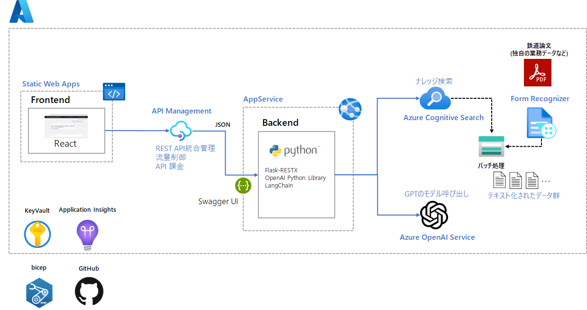
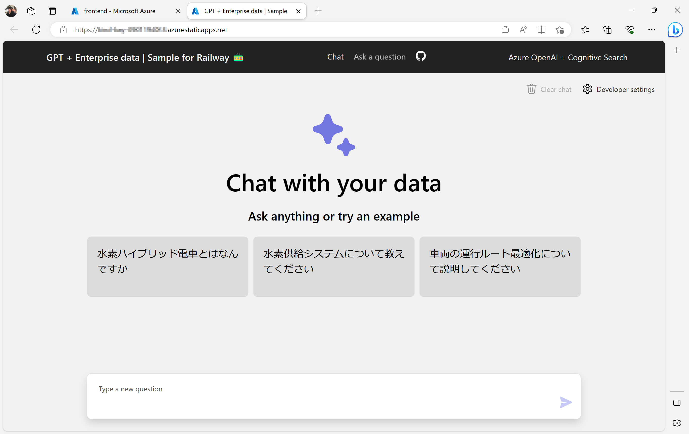
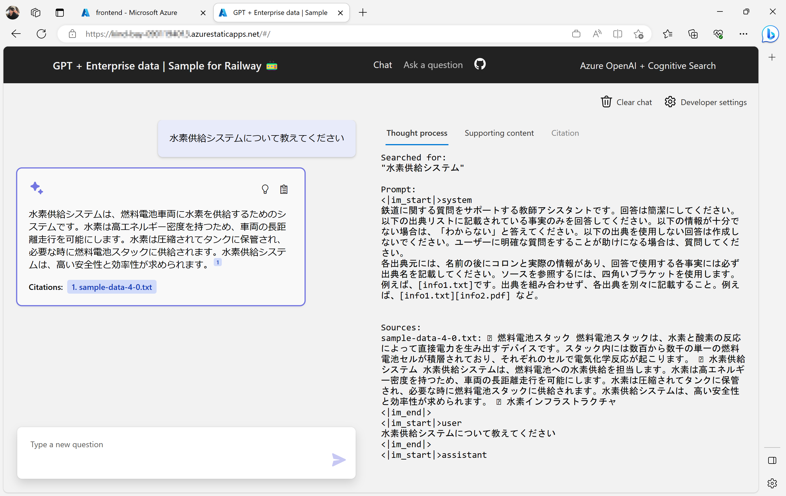
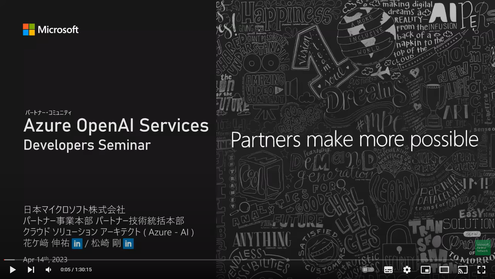
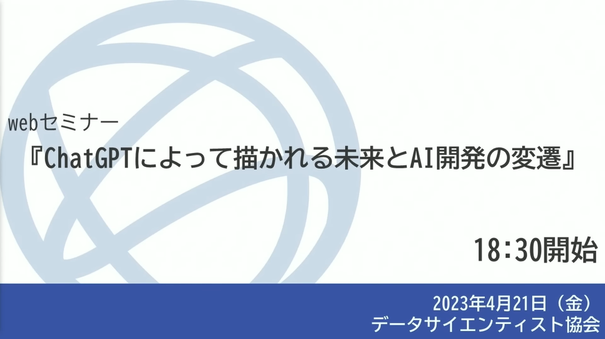

# 業務データを活用したAIチャット ワークショップ

このリポジトリは業務データを活用したAIチャットシステムを構築するためのワークショップ資料です。
[ChatGPT + Enterprise data with Azure OpenAI and Cognitive Search - 日本語カスタマイズ版 /@nohanaga](https://github.com/nohanaga/azure-search-openai-demo) をベースに作成しています。

ワークショップ資料は[こちら](https://asashiho.github.io/azure-search-openai-demo/)

---
## ワークショップ概要

  研究論文の内容もとに適切な回答を作成するチャットシステム の作成を通して、Azure OpenAI Service やAzure Cognitive Searchなどの使い方やチャットシステムを社内に展開するためのWebアプリケーションの作成やAPI基盤の整備などの基礎を学びます。

このワークショップの特徴は次の2つです。

- **専門用語や業界独自のナレッジを検索できる**

ChatGPT(gpt-35-turbo)モデルでトレーニングされたデータに基づいてテキストを生成するのではなく、企業内に閉じたデータのみから生成します

- **回答の根拠を明確にする**

ChatGPTの回答に「引用」をテキストに付加することで信頼できる応答を生成します

### 対象者
このワークショップは、AI技術に興味のあるデータサイエンティスト、エンジニア、研究者、または企業内での情報アクセスやナレッジ共有の改善を目指す方々に適しています。

### 参考資料

Azure OpenAI Serviceについての技術詳細は、以下を参照してください。

* [ChatGPT + Enterprise data with Azure OpenAI and Cognitive Search](https://github.com/nohanaga/azure-search-openai-demo)

* [Azure で ChatGPT × Cognitive Search を使ったエンタープライズサーチを実現](https://qiita.com/nohanaga/items/803c09b5a3a4e2d1776f)

## Resources

* [Revolutionize your Enterprise Data with ChatGPT: Next-gen Apps w/ Azure OpenAI and Cognitive Search](https://aka.ms/entgptsearchblog)
* [Azure Cognitive Search](https://learn.microsoft.com/azure/search/search-what-is-azure-search)
* [Azure OpenAI Service](https://learn.microsoft.com/azure/cognitive-services/openai/overview)

### Note
>Note: The PDF documents used in this demo contain information generated using a language model (Azure OpenAI Service). The information contained in these documents is only for demonstration purposes and does not reflect the opinions or beliefs of Microsoft. Microsoft makes no representations or warranties of any kind, express or implied, about the completeness, accuracy, reliability, suitability or availability with respect to the information contained in this document. All rights reserved to Microsoft.
